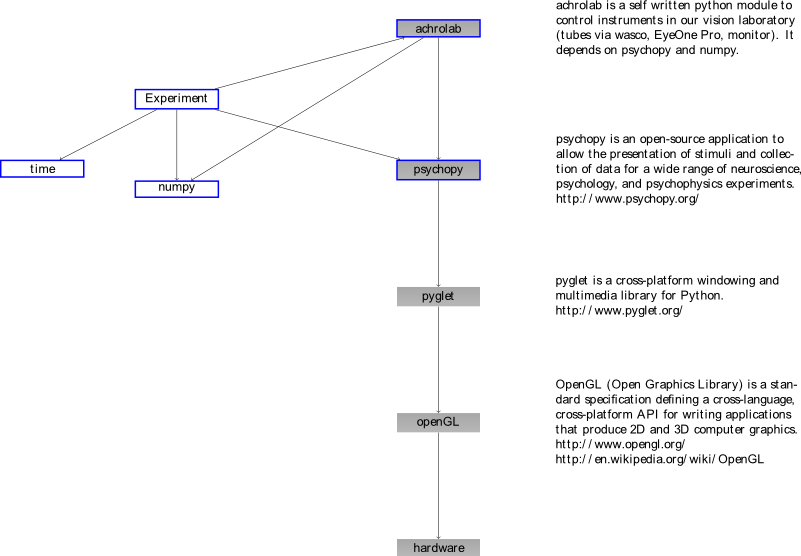

.. _achrolab_contribute:

Contributing to `achrolab`
==========================

`achrolab` is free software. You are free to modify the software under the
terms of the license that is distributed with `achrolab`. We welcome
developers that want to contribute to `achrolab`.

If you want to contribute to this module, here are some guidelines to make
it as smooth as possible.

You might want to check out our :ref:`lab conventions
<colorlab_convention>` as well.

How *achrolab* Interacts
~~~~~~~~~~~~~~~~~~~~~~~~

You can find a much more detailed graph about how *achrolab*'s classes
interact with other python modules created using pyreverse `here
<_images/classes_achrolab.png>`_.

Dependencies
~~~~~~~~~~~~

Run-Time
++++++++

* `Python <http://www.python.org>`_ (2.7+ <3)
* `Psychopy <http://psychopy.org/>`_ (1.70+)
* `Numpy <http://numpy.scipy.org/>`_ (1.6.2+)
* `Scipy <http://scipy.org/>`_ (0.10.1+)

Documentation
+++++++++++++

* sphinx (1.1+)
* make

Testing
+++++++

* py.test

Conventions
~~~~~~~~~~~

Python
++++++

We follow the `Style Guide for Python Code
<http://www.python.org/dev/peps/pep-0008/>`_ for more details see :ref:`lab
conventions for Python <colorlab_convention_python>`.

Git and Github
++++++++++++++

The source code is hosted on https://github.com/derNarr/achrolabutils and
the projects website can be found via
http://www.uni-tuebingen.de/psychologie/meth/colorlab.

For a very short introduction into git and our git conventions see :ref:`lab
conventions for git <colorlab_convention_git>`.

