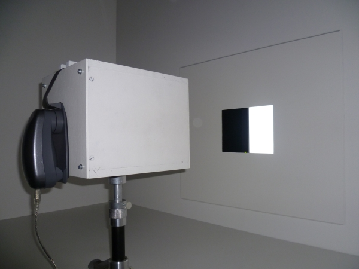
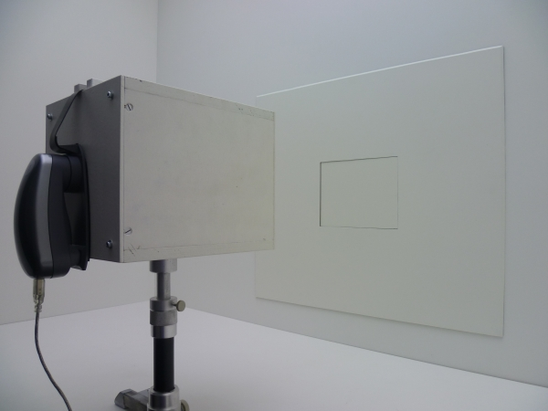
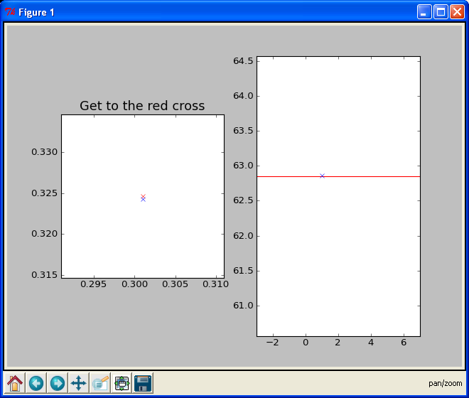

.. _achrolab_tutorial:

How to Calibrate the Booth
==========================

This tutorial is a step-by-step introduction on how to calibrate the tubes
and adjust them so that the walls have the same luminance as the monitor.
We call this procedure 'calibrating our booth.' Most parts of this tutorial
might only be interesting for people who actually work in our lab.

In order to do this just run :meth:`~achrolab.calibrate.Calibrate` for the
color(s) you are interested in and it will perform the following steps and
prompt you to change settings and press the i1 Pro button a lot. Since the
monitor is black-and-white by color we mean the luminance values you are
interested in.

Measure Monitor Color
~~~~~~~~~~~~~~~~~~~~~

.. _labor26:

   Setting for measuring luminance of monitor.

The very first step is to measure the color of the monitor through our
measurement box. Make sure that you removed the piece that covers the
cut-out in the wall, that the tubes are switched off, and that the room is
completely dark.

We use a 10 bit black-and-white monitor (`EIZO GS320
<http://www.eizo.com/global/products/radiforce/index.html>`_) that
displays 1024 different shades of gray. We usually refer to the monitor
colors by numbers between 0 and 1023; 0 being the lowest luminance value
and 1023 the maximum luminance. 

You will be prompted to put the i1 Pro in measurement position and then
press the button to start the measurement.

Luminance Functions
~~~~~~~~~~~~~~~~~~~

The next step is to find the luminance functions for the tubes. This means
we want to find a function that connects the voltage we give to the tubes
via the multifunction card (see hardware in :ref:`colorlab_hardware`) with
the luminance of the tubes. More precisely, we measure the luminance
reflected by the wall when we adjust the tubes.

The tubes need to run for four hours before they reach a stable luminance
(see :ref:`colorlab_issues` for more details and some graphs). This means
if you want to do it perfectly, you have to measure the different color
channels on three different days. Since the luminance functions only give
you a starting point for the manual adjustment you can also measure them
right after you switched them on.

.. _labor27:

   Setting for measuring luminance functions of tubes.

We close the cut-out in the wall and measure all three color channels
separately. That means we will have to switch off the tubes of the colors
we do not measure right now and that we will get three luminance functions:
one for the red, green, and blue channel, respectively.

We fit a non-linear regression function (see [Pinheiro_Bates_2000]_) to
the data since it describes the relationship of voltage and luminance best.

.. math::

   y(x) = \phi_1 + (\phi_2 - \phi_1)\exp{(-\exp{(\phi_3)}x)} 

Then, we determine the inverse function to get the correct voltage value
for a certain luminance.

.. math::

   x(y) = -\frac{\log{(\frac{y - \phi_1}{\phi_2 - \phi_1})}}{\exp{(\phi_3)}}

The parameters found for your current measurement will now be used to
calculate the voltages for the tubes and they will be set accordingly. This
will be our starting point which will be measured by the i1 Pro now.

Set Tubes Manually
~~~~~~~~~~~~~~~~~~

You can now remove the cut-out piece again and look at the configuration.
Probably the color of the monitor and the color of the wall do not match
exactly. We have xyY coordinates for the monitor as well as for the tubes
now (see :ref:`colorlab_theory`). They will probably also not be exactly
the same. We can adjust this point by hand now (but make sure that all
tubes have been running for at least 4 hours by now!). Put the cut-out
piece back in and press the button. Adjust the tubes. You will get a new
graph on the monitor for the experimenter after each adjustment. Stop when
the red cross hits the blue cross on the left side and the cross lies on
the line on the right side. On the left you adjust the xy color coordinates
and on the right you adjust the brightness Y.

.. _screenshot:

   Interface for adjusting the tubes manually.

Now take out the cut-out piece again and look at it. If it still does not
look right even though the colorimetric properties of wall and monitor are
identical now, adjust by hand using your eye. So far, we always had to do
this.

Get Color Table
~~~~~~~~~~~~~~~

This final configuration will now be saved as a colorentry object. You now
have a color table that gives you the name of a color (between 0 and 1023),
the corresponding coordinates in xyY color space, standard deviations for
these three values, voltages for each channel (red, green, and blue), the
corresponding xyY coordinates, and their standard deviations. 

References
~~~~~~~~~~
.. [Pinheiro_Bates_2000]  Pinheiro, J. C. and Bates, D. M. (2000). *Mixed-Effects Models in S and S-PLUS*. New York: Springer

